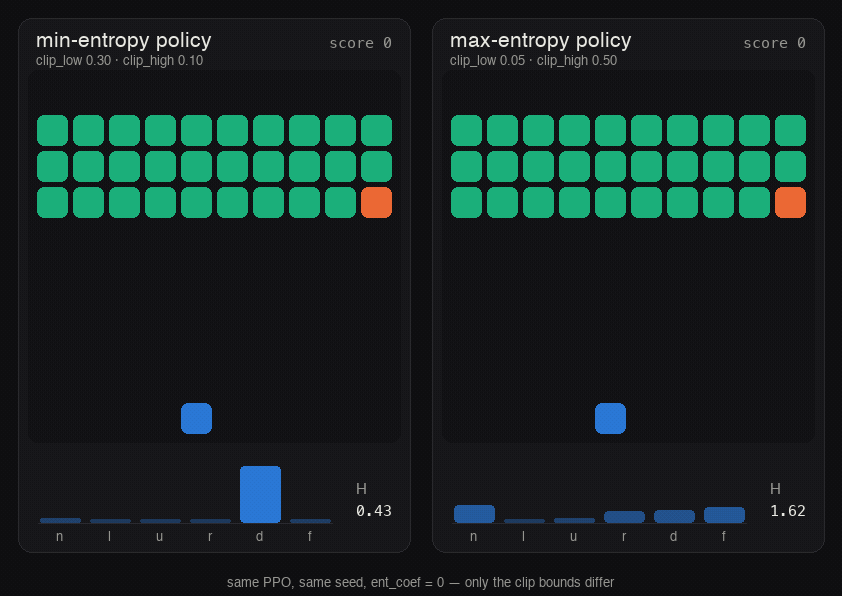
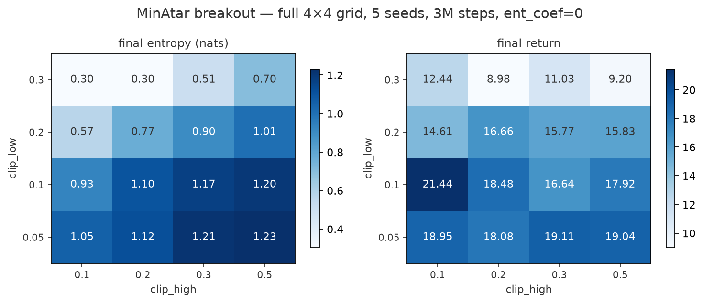
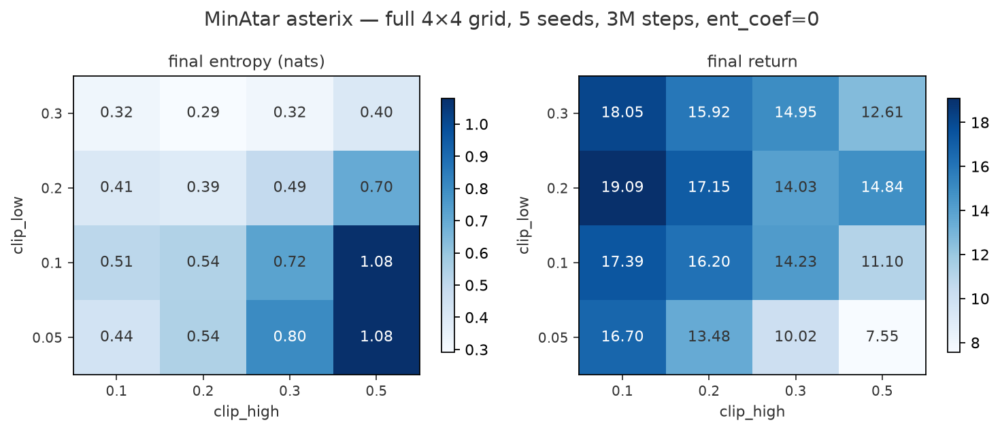
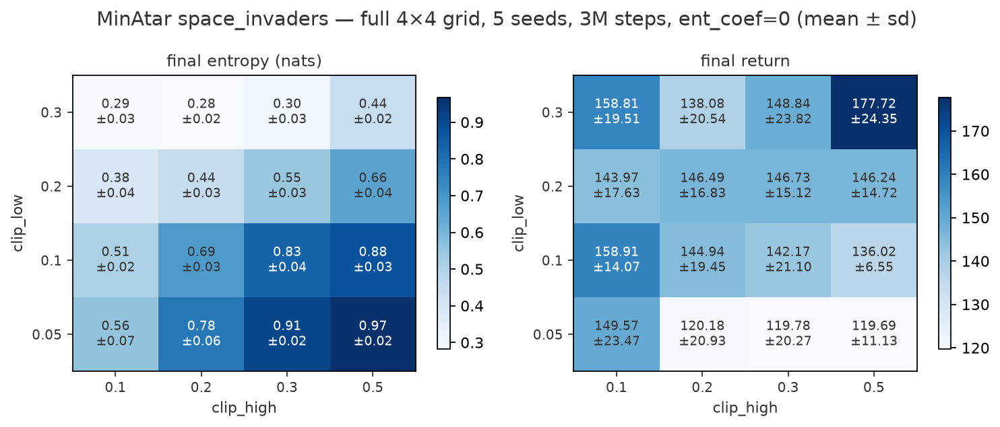
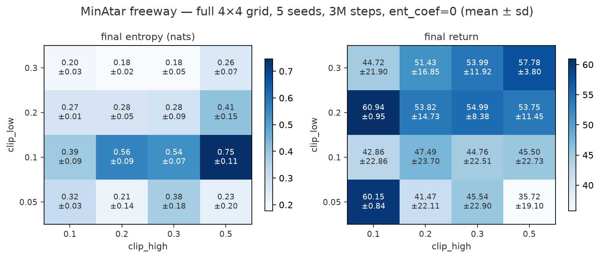
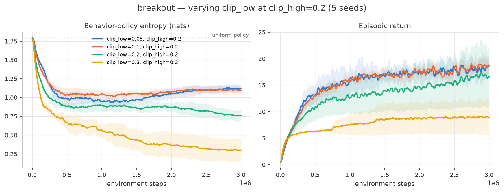

# ppo-clip-asymmetry

[](https://github.com/krrprnv/ppo-clip-asymmetry/actions/workflows/tests.yml)

In 2025 the LLM-RL world found out that PPO's two clip bounds do different
jobs: tightening the lower bound pushes policy entropy up, tightening the upper
bound pushes it down ([Park et al., arXiv:2509.26114](https://arxiv.org/abs/2509.26114)).
DAPO trains frontier reasoning models on this ([arXiv:2503.14476](https://arxiv.org/abs/2503.14476)).
The discovery was made on models with ~100,000-token action spaces, and as far
as I can tell nobody has checked whether it holds in the environments PPO
actually came from.

That's this repo. A from-scratch PPO where `clip_low` and `clip_high` are
separate knobs, the entropy bonus is hard-zeroed, and the question is run as a
grid on MinAtar (action space of six):

$$L(\theta) = \mathbb{E}\left[ \min\!\big( r_t A_t,\ \mathrm{clip}(r_t,\ 1-\epsilon_{low},\ 1+\epsilon_{high})\, A_t \big) \right]$$

If the mechanism transfers, every symmetric-clip PPO since 2017 has been
carrying a hidden entropy regularizer inside its clip range. If it doesn't,
the hottest clipping trick in LLM-RL is a large-vocabulary artifact, which is
what DPPO ([arXiv:2602.04879](https://arxiv.org/abs/2602.04879)) predicts.
Either answer is worth having.

## Results

**Full experiment: 4×4 grid (clip_low × clip_high) × 5 seeds × 3M steps,
`ent_coef = 0`, on breakout, asterix, space_invaders, and freeway: 320 runs.**

What the entropy difference looks like as behavior: same algorithm, same
seed, only the clip bounds differ. Watch the action distributions: the
min-entropy policy keeps collapsing to a single bar, the max-entropy one
stays spread (regenerate with `uv run python -m ppo.render`):








The dose-response, seen directly (one slice shown; the clip_high slice and
asterix versions are in `figures/`):



Three findings:

1. **The mechanism transfers — in dense-reward games.** Tighter `clip_low` →
   higher entropy, looser `clip_high` → higher entropy, with no entropy bonus
   anywhere. Breakout: strictly monotone along both axes, all 16 cells,
   spanning 0.30 to 1.23 nats from the clip setting alone. Space_invaders:
   monotone within the seed bands on both axes. Asterix: trend holds with
   local inversions at the tightest `clip_low` (0.44 ± 0.03 at (0.05, 0.1)
   vs 0.51 ± 0.02 at (0.1, 0.1) — outside the bands, a real wrinkle).
   Freeway — the sparse-reward game — breaks the pattern: no monotone
   structure, and the tightest-`clip_low` row is seed-bimodal (entropy sd up
   to ±0.20, return sd up to ±23: some seeds solve at ~60, others collapse).
   Same signs Park et al. measured at |A|≈100k, reproduced at |A|=6 — where
   reward is dense enough for the advantage signal to be consistent.
2. **`clip_low` is the dominant dial** in three of the four games, moving
   entropy ~2-3× further than `clip_high` at matched widths. The literature's
   obsession with clip-higher (DAPO) targets the weaker of the two knobs, at
   least at this scale.
3. **The performance effect is environment-specific everywhere.** Return
   correlates *positively* with entropy on breakout (tight-clip_low rows
   ~18–21 vs ~9–12, outside the bands), *negatively* on asterix (max-entropy
   corner: 7.6 ± 2.1), is *flat* on space_invaders (most cells 120–160 with
   sds up to ±24; the best cell is a low-entropy one), and *unstable* on
   freeway (the two best cells, ~60 with sd <1, are both tight-`clip_high`;
   most others are seed-bimodal). Cell-level rankings are noise in every
   game — only row-level patterns survive the error bars. Clip asymmetry is
   a real entropy knob, not a free lunch — what to do with the knob is a
   property of the environment.

The 3-seed pilot that motivated the full grid (and caught my sign error in
the mechanism story, see [GUIDE.md](GUIDE.md#7-splitting-the-clip)) is
preserved in `figures/pilot_*`.

## Run it

```bash
uv sync

# tests: GAE against hand-computed values, the clip's dead-zone geometry,
# env wrapper, bit-exact determinism
uv run pytest

# one training run
uv run python -m ppo.train --env minatar/breakout --clip-low 0.05 --clip-high 0.5

# the experiment (4x4 grid x 5 seeds; overnight on a laptop, resumable)
uv run python -m ppo.sweep --env minatar/breakout --out runs/breakout-grid
uv run python -m ppo.plot --runs runs/breakout-grid --out figures --prefix breakout
```

## What's in here

| file | what it is |
|---|---|
| `ppo/core.py` | the whole algorithm, one file. GAE, rollout, asymmetric-clip update |
| `ppo/envs.py` | tiny vectorized wrapper: classic control + MinAtar, truncation done right |
| `ppo/train.py` / `ppo/sweep.py` | one run / the resumable parallel grid |
| `ppo/plot.py` / `ppo/render.py` | figures from run logs / the comparison GIF |
| `walkthrough.ipynb` | the objective drawn until it makes sense, plus live mini-runs |
| `GUIDE.md` | teaches PPO from zero: the math, the loop, the telemetry, the finding |
| `tests/` | the math, as assertions |

## Design decisions that matter

- **`ent_coef = 0` everywhere.** With an entropy bonus on, entropy differences
  between clip settings could be bonus-clip interaction. Off, every nat is
  attributable to the clip.
- **The clip has to actually fire.** Under CleanRL-default hyperparameters on
  MinAtar the ratio leaves the clip range on <0.3% of samples, so asymmetry
  would be inert and the grid would measure seed noise. I probed until
  clipping engaged (~2%/side at `epochs=8, lr=1e-3`) while learning got
  *faster*. Probe table in [GUIDE.md](GUIDE.md#8-experimental-design-decisions-and-why).
- **Entropy is measured on the behavior policy**, at collection time, before
  any gradient step touches the network.
- **Truncation is not death.** Time-limit endings bootstrap $\gamma V(s_{final})$
  instead of pretending the state was terminal. Most single-file PPOs skip
  this; it biases the critic on every truncated episode.

## Honest limitations

- MinAtar's entropy ceiling is $\ln 6 \approx 1.79$ nats; all effects live
  inside that. 5 seeds per cell; heatmaps report mean ± sd.
- **The clip bounds also change update size, not just which samples die:**
  realized per-update KL varies ~4× across the grid (≈0.0003 at clip_low=0.05
  up to ≈0.0012+ at clip_low=0.3, both games). Entropy differences therefore
  co-move with step-size differences, and this experiment cannot separate
  "the clip's dead zones move entropy" from "smaller effective updates
  preserve entropy." A KL-matched control is the single most important
  follow-up.
- Four games, one environment family. The freeway result suggests reward
  sparsity moderates the mechanism — worth a targeted follow-up, not a claim.
- One training regime (`epochs=8, lr=1e-3`). The action-space-size
  dose-response (6 → 18 → hundreds), which would directly test DPPO's
  vocabulary-size hypothesis, isn't run yet.
- This is a student replication study of a mechanism, not a new method. If the
  full grid shows nothing outside the bands, that's the finding and it stays
  in this README.

## References

Park et al., *Clip-Low Increases Entropy and Clip-High Decreases Entropy in RL of LLMs* — [2509.26114](https://arxiv.org/abs/2509.26114) ·
DAPO — [2503.14476](https://arxiv.org/abs/2503.14476) ·
DPPO — [2602.04879](https://arxiv.org/abs/2602.04879) ·
PPO — [1707.06347](https://arxiv.org/abs/1707.06347) ·
GAE — [1506.02438](https://arxiv.org/abs/1506.02438) ·
Engstrom et al. — [2005.12729](https://arxiv.org/abs/2005.12729) ·
Andrychowicz et al. — [2006.05990](https://arxiv.org/abs/2006.05990) ·
MinAtar — [1903.03176](https://arxiv.org/abs/1903.03176)
