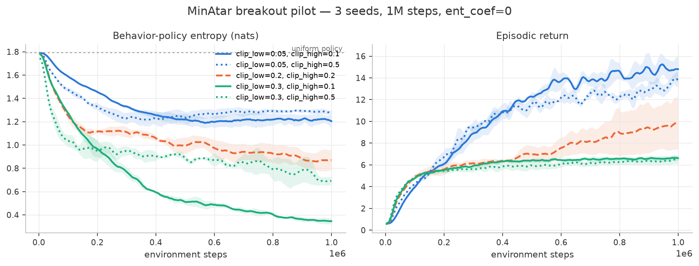

# ppo-clip-asymmetry

In 2025 the LLM-RL world found out that PPO's two clip bounds do different
jobs: loosening the lower bound pushes policy entropy up, loosening the upper
bound pushes it down ([Park et al., arXiv:2509.26114](https://arxiv.org/abs/2509.26114)).
DAPO trains frontier reasoning models on this ([arXiv:2503.14476](https://arxiv.org/abs/2503.14476)).
The discovery was made on models with ~100,000-token action spaces, and as far
as I can tell nobody has checked whether it holds in the environments PPO
actually came from.

That's this repo. A from-scratch PPO where `clip_low` and `clip_high` are
separate knobs, the entropy bonus is hard-zeroed, and the question is run as a
grid on MinAtar (action space of six):

$$L(\theta) = \mathbb{E}\left[ \min\!\big( r_t A_t,\ \mathrm{clip}(r_t,\ 1-\epsilon_{low},\ 1+\epsilon_{high})\, A_t \big) \right]$$

If the mechanism transfers, every symmetric-clip PPO since 2017 has been
carrying a hidden entropy regularizer inside its clip range. If it doesn't,
the hottest clipping trick in LLM-RL is a large-vocabulary artifact — which is
what DPPO ([arXiv:2602.04879](https://arxiv.org/abs/2602.04879)) predicts.
Either answer is worth having.

## Results so far

**Pilot: breakout, 4 corner cells + the PPO baseline, 3 seeds, 1M steps,
`ent_coef = 0`.** Both predicted signs show up, cleanly outside the seed bands:



| cell (clip_low, clip_high) | final entropy | final return |
|---|---|---|
| (0.05, 0.5) — max-entropy corner | **1.29 ± 0.02** | 13.3 ± 0.5 |
| (0.05, 0.1) | 1.22 ± 0.04 | **14.8 ± 0.9** |
| (0.2, 0.2) — plain PPO | 0.99 ± 0.06 | 7.5 ± 0.9 |
| (0.3, 0.5) | 0.73 ± 0.06 | 6.4 ± 0.4 |
| (0.3, 0.1) — min-entropy corner | **0.35 ± 0.02** | 6.6 ± 0.3 |

Three things I did not expect to be this clear at 1M steps:

1. **The mechanism transfers.** Tighter `clip_low` → higher entropy; looser
   `clip_high` → higher entropy. Same signs Park et al. measured at |A|≈100k,
   here at |A|=6, with no entropy bonus anywhere.
2. **`clip_low` is the dominant dial** (0.35 → 1.29 nats across its range;
   `clip_high` moves entropy by ~0.1–0.4 at fixed `clip_low`).
3. **The high-entropy cells learn twice as fast.** (0.05, 0.1) hits ~15 return
   while plain PPO sits at ~7.5. On breakout, at this budget, the hidden
   entropy regulator inside the clip is worth more than the symmetric default.

Pilot caveats: one game, 3 seeds, 1M steps, and the (0.05, ·) cells' return
advantage may be breakout-specific exploration. The full 4×4 grid × 5 seeds ×
3M steps on breakout *and* asterix is queued; heatmaps land here when it does.

## Run it

```bash
uv sync

# tests: GAE against hand-computed values, the clip's dead-zone geometry,
# env wrapper, bit-exact determinism
uv run pytest

# one training run
uv run python -m ppo.train --env minatar/breakout --clip-low 0.05 --clip-high 0.5

# the experiment (4x4 grid x 5 seeds; overnight on a laptop, resumable)
uv run python -m ppo.sweep --env minatar/breakout --out runs/breakout-grid
uv run python -m ppo.plot --runs runs/breakout-grid --out figures --prefix breakout
```

## What's in here

| file | what it is |
|---|---|
| `ppo/core.py` | the whole algorithm, one file. GAE, rollout, asymmetric-clip update |
| `ppo/envs.py` | tiny vectorized wrapper: classic control + MinAtar, truncation done right |
| `ppo/train.py` / `ppo/sweep.py` | one run / the resumable parallel grid |
| `ppo/plot.py` | trajectories + heatmap figures from run logs |
| `walkthrough.ipynb` | the objective drawn until it makes sense, plus live mini-runs |
| `GUIDE.md` | full derivation, the dead-zone table, design decisions, reading list |
| `tests/` | the math, as assertions |

## Design decisions that matter

- **`ent_coef = 0` everywhere.** With an entropy bonus on, entropy differences
  between clip settings could be bonus-clip interaction. Off, every nat is
  attributable to the clip.
- **The clip has to actually fire.** Under CleanRL-default hyperparameters on
  MinAtar the ratio leaves the clip range on <0.3% of samples — asymmetry
  would be inert and the grid would measure seed noise. I probed until
  clipping engaged (~2%/side at `epochs=8, lr=1e-3`) while learning got
  *faster*. Probe table in [GUIDE.md](GUIDE.md#6-experimental-design-decisions-and-why).
- **Entropy is measured on the behavior policy**, at collection time, before
  any gradient step touches the network.
- **Truncation is not death.** Time-limit endings bootstrap $\gamma V(s_{final})$
  instead of pretending the state was terminal. Most single-file PPOs skip
  this; it biases the critic on every truncated episode.

## Honest limitations

- MinAtar's entropy ceiling is $\ln 6 \approx 1.79$ nats. Effects are small in
  absolute terms; only the seed bands make them meaningful. 5 seeds.
- One environment family so far. The action-space-size dose-response (6 → 18 →
  hundreds) is the load-bearing arm of the original design and isn't run yet.
- This is a student replication study of a mechanism, not a new method. If the
  full grid shows nothing outside the bands, that's the finding and it stays
  in this README.

## References

Park et al., *Clip-Low Increases Entropy and Clip-High Decreases Entropy in RL of LLMs* — [2509.26114](https://arxiv.org/abs/2509.26114) ·
DAPO — [2503.14476](https://arxiv.org/abs/2503.14476) ·
DPPO — [2602.04879](https://arxiv.org/abs/2602.04879) ·
PPO — [1707.06347](https://arxiv.org/abs/1707.06347) ·
GAE — [1506.02438](https://arxiv.org/abs/1506.02438) ·
Engstrom et al. — [2005.12729](https://arxiv.org/abs/2005.12729) ·
Andrychowicz et al. — [2006.05990](https://arxiv.org/abs/2006.05990) ·
MinAtar — [1903.03176](https://arxiv.org/abs/1903.03176)
